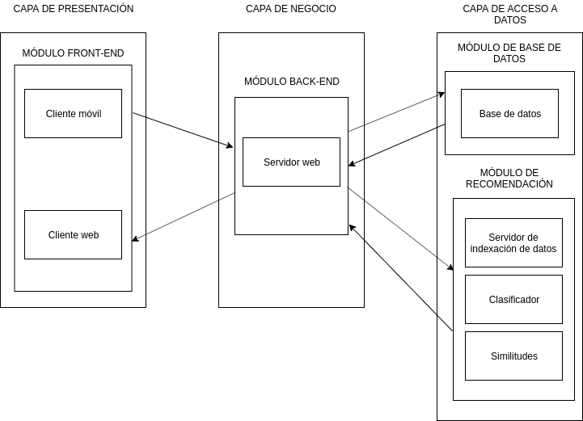

# Tema 1: Arquitecturas software para la nube

### Ejercicio 1: Buscar una aplicación de ejemplo, preferiblemente propia, y deducir qué patrón es el que usa. ¿Qué habría que hacer para evolucionar a un patrón tipo microservicios?

Para hacer este ejercicio, voy a escoger la plataforma que realicé para mi Trabajo Fin de Grado, la cual está compuesta por una aplicación web y una aplicación móvil. En esta plataforma, los usuarios podían valorar, debatir y buscar libros ya leídos y descubrir nuevos mediante las recomendaciones que hace la misma.

Para esta plataforma, se puede observar que se ha usado una "arquitectura de 3 capas", ya que los módulos del sistema están separados, de manera lógica, por capas, para así reducir la complejidad del sistema.

En este esquema, se observa que, en la capa de presentación, se incluye el front-end de la aplicación y el cliente móvil, que solicitan la información que necesitan al servidor web, interaccionando así con la capa de negocio.

Luego, el servidor recibe la solicitud y, a su vez, este llamará a la capa de acceso a los datos, en concreto, al módulo de base de datos, para obtener los datos solicitados y devolvérselos al servidor web. En el caso de que se haya solicitado una recomendación, el servidor solicitará la recomendación al módulo de recomendación, ubicado en la capa de acceso a datos; ya posteriormente, este módulo llamará a sus correspondientes submódulos para obtener la recomendación y devolvérsela al servidor web.

Finalmente, una vez el servidor ha obtenido toda la información que se le ha pedido, este se la devolverá al cliente, para que se la muestre al usuario.

Pues bien, para evolucionar esta plataforma a un patrón de tipo microservicios, habría que crear un microservicio por cada funcionalidad de los módulos de la plataforma, por lo que tendríamos: un microservicio para el acceso a la base de datos, otro para gestionar las peticiones que lleguen desde el móvil, otro para gestionar las peticiones que lleguen desde la web y un microservicio que administre cada tipo de recomendación. También, se necesitará un sistema de mensajería centralizado, que gestione la arquitectura y permita fácilmente el acoplamiento de nuevos servicios en el futuro. 

### Ejercicio 2: En la aplicación que se ha usado como ejemplo en el ejercicio anterior, ¿podría usar diferentes lenguajes? ¿Qué almacenes de datos serían los más convenientes?

En el proyecto que hice, se pueden usar diferentes lenguajes, de echo para la aplicación móvil se usó React Native, para la aplicación web se utilizó React y para el servidor se usó Express, aunque, con la nueva arquitectura basada en microservicios, podríamos escoger el lenguaje más adecuado para programar esa funcionalidad, por ejemplo, para la recomendación, podríamos escoger un lenguaje compilado para hacer más rápidos los cálculos.

Respecto a los almacenes de datos, en mi proyecto, se escogió MongoDB como motor de bases de datos NoSQL. En mi opinión, se optó por el almacén de datos correcto, por su flexibilidad en la estructura de datos (por ejemplo, hay libros que no tienen ISBN-13, y otros que sí), su escabilidad y rendimiento (al poder leer y escribir siempre), por lo que no cambiaría mi decisión.
