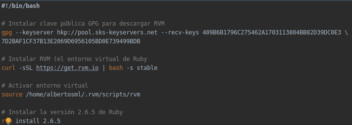
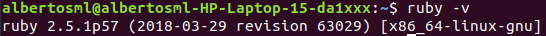
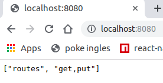
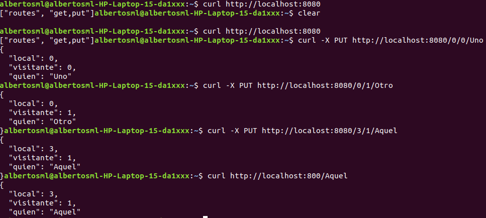
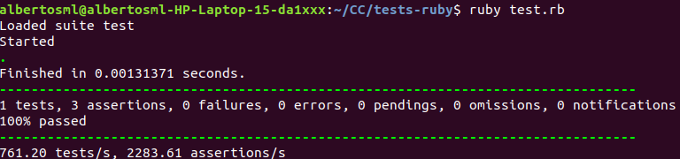
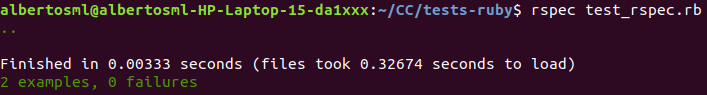
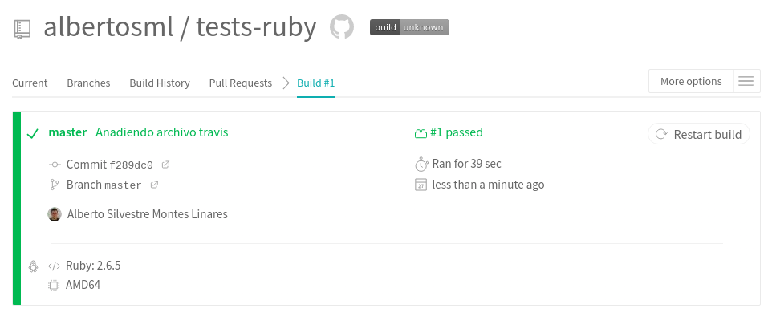

# Tema 2: Desarrollo basado en pruebas

### Ejercicio 1: Instalar alguno de los entornos virtuales de node.js (o de cualquier otro lenguaje con el que se esté familiarizado) y, con ellos, instalar la última versión existente, la versión minor más actual de la 4.x y lo mismo para la 0.11 o alguna impar (de desarrollo).

Aquí, se ha optado por instalar el entorno virtual de Ruby `rvm`, para ello, se han ejecutado los siguientes 
comandos:



Para hacer esto, se han usado las siguientes fuentes:
- https://rvm.io/
- https://phoenixnap.com/kb/how-to-install-ruby-on-ubuntu-18-04

Aquí, se ha instalado un entorno virtual con la versión 2.6.5 de Ruby, y en mi equipo local se dispone de la versión 
2.5.1 de este mismo lenguaje.



### Ejercicio 2: Crear una descripción del módulo usando package.json. En caso de que se trate de otro lenguaje, usar el método correspondiente.

Para especificar las dependencias del módulo, se tiene que crear un archivo llamado Gemfile, el cual para nuestro 
proyecto, debe contener lo siguiente:

```
source 'https://rubygems.org'

gem "sqlite", "~> 1.0.2"
gem "bundler", "-> 2.0.2"
gem "rspec", "-> 3.9.0"
```

Para instalar las gemas especificadas en el archivo, simplemente habría que ejecutar el comando `bundle install`.

### Ejercicio 3: Descargar el repositorio de ejemplo anterior, instalar las herramientas necesarias (principalmente Scala y sbt) y ejecutar el ejemplo desde sbt. Alternativamente, buscar otros marcos para REST en Scala tales como Finatra o Scalatra y probar los ejemplos que se incluyan en el repositorio.

En este ejercicio, hay que hacer los siguientes pasos:

1- Clonar el repositorio de ejemplo.

`git clone git://github.com/JJ/spray-test my-project`

2- Ir al repositorio del proyecto.

`cd my-project`

3- Instalar sbt.

```
sudo apt-get update  
echo "deb https://dl.bintray.com/sbt/debian /" | sudo tee -a /etc/apt/sources.list.d/sbt.list  
sudo apt-key adv --keyserver hkp://keyserver.ubuntu.com:80 --recv 2EE0EA64E40A89B84B2DF73499E82A75642AC823  
sudo apt-get update  
sudo apt-get install sbt

sudo apt install openjdk-8-jdk # SBT se debe usar con java version 8
```

Fuente: https://gist.github.com/XaheenA/301728e245e0b04a6bc88827fa405291

4- Compilar y ejecutar los tests 

```
test
```

5- Ejecuto la aplicación

```
re-start
```

6- Pruebo el servidor





7- Paro la aplicación.

```
re-stop
```

### Ejercicio 4: Para la aplicación que se está haciendo, escribir una serie de aserciones y probar que efectivamente no fallan. Añadir tests para una nueva funcionalidad, probar que falla y escribir el código para que no lo haga. A continuación, ejecutarlos desde mocha (u otro módulo de test de alto nivel), usando descripciones del test y del grupo de test de forma correcta. Si hasta ahora no has subido el código que has venido realizando a GitHub, es el momento de hacerlo, porque lo vamos a necesitar un poco más adelante.

En este ejercicio, se ha creado una aplicación para posteriormente testearla.

```
class Partido
	# Constructor
	def initialize(identificador, fecha, descripcion)
		# Atributos
		@id = identificador
		@fecha = fecha
		@descripcion = descripcion
	end

	# Métodos get
	def id
		@id
	end

	def fecha
	    @fecha
	end

	def descripcion
	    @descripcion
	end

	# Métodos set
	def id=(id)
		@id = id
	end

	def fecha=(f)
        @fecha = f
    end

    def descripcion=(d)
        @descripcion = d
    end
end

class PorraDeportiva
	# Constructor
	def initialize(partido, persona, resultado)
		# Atributos
		@partido = partido
		@persona = persona
		@resultado = resultado
	end

	# Métodos get
    def partido
        @partido
    end

    def persona
        @persona
    end

    def resultado
        @resultado
    end

    # Métodos set
    def partido=(p)
        @partido = p
    end

    def persona=(p)
        @persona = p
    end

	def resultado=(r)
		@resultado = r
	end
end
```

Una vez creada la aplicación para gestionar porras deportivas, se le ha preparado una serie de tests unitarios:

```
require_relative 'porras_deportivas'
require 'test/unit'
require 'date'

class TestPorraDeportiva < Test::Unit::TestCase	
	def test_porra
		partido = Partido.new(1, DateTime.now, 'Granada-Betis')
		assert partido.id = 1, "Ese partido no existe"
		
		porra = PorraDeportiva.new(partido, 'Alberto', '1-0')
		assert porra.partido.id = 1, 'Esta porra no es para el partido 1'
		assert porra.persona == 'Alberto', 'La porra no la ha hecho Alberto'
	end
end
```

Y, de aquí se han obtenido los siguientes resultados:



Por último, se han realizado los tests usando un módulo de tests de alto nivel, llamado `rspec`, para el cual se ha
programado el siguiente código:

```
require_relative 'porras_deportivas'
require 'rspec'
require 'date'

describe Partido do
	let(:partido) { Partido.new(1, DateTime.now, "Granada-Betis") }

	it "Partido existe" do
        expect(partido.id).to eq 1
	end

	it "Porra a un partido existente" do
        porra = PorraDeportiva.new(partido, "Alberto", "1-0")
        expect(porra.partido.id).to eq 1
	end
end
```

Para el cual, se han obtenido los siguientes resultados:



### Ejercicio 5: Haced los dos primeros pasos antes de pasar al tercero.

Primero de todo, me he dado de alta en Travis y he habilitado el [repositorio](https://github.com/albertosml/tests-ruby).

Luego, he creado el archivo `.travis.yml`, el cual contiene lo necesario para ejecutar los tests:

```
language: ruby
rvm:
  - 2.6.5
before_install:
  - gem install rspec
script:
  - ruby test.rb
  - rspec test_rspec.rb
```

Y, finalmente, estos han sido los resultados en Travis:

